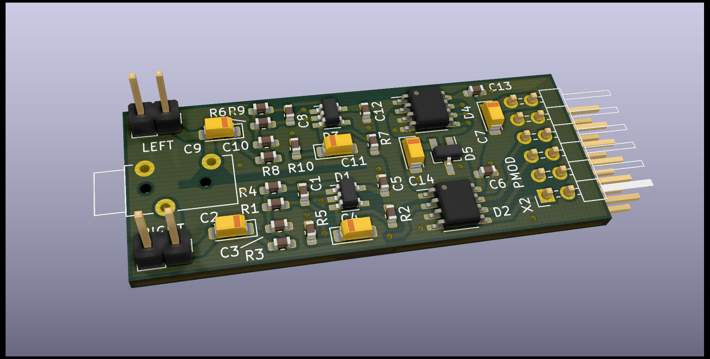
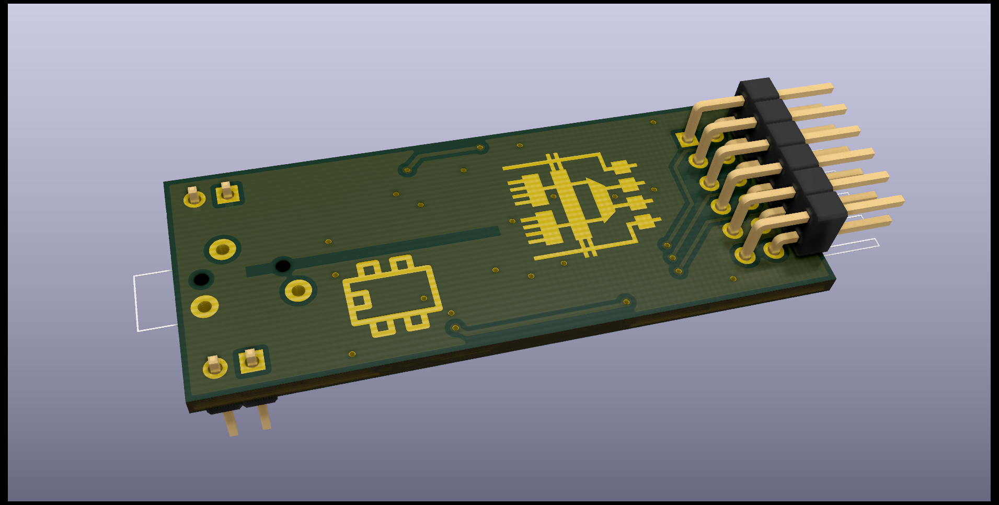

# Модуль PMOD с двумя АЦП MCP3201

На модуле установлены два АЦП __MCP3201__ (интерфейс SPI), источник опорного
напряжения __REF3030__ с напряжением 3.0В и антиалиасинговые фильтры с полосой
10Гц-100кГц. Распиновка разъема PMOD стандартная:

| Pin | Signal | Dir. |
|-----|--------|------|
| 1   | SS_N_L | IN   |
| 2   | --     |      |
| 3   | MISO_L | OUT  |
| 4   | SCLK_L | IN   |
| 5   | GND    |      |
| 6   | +3.3V  |      |
| 7   | SS_N_R | IN   |
| 8   | --     |      |
| 9   | MISO_R | OUT  |
| 10  | SCLK_R | IN   |
| 11  | GND    |      |
| 12  | +3.3V  |      |

3D рендер платы:

АЧХ антиалиасинговых фильтров:

